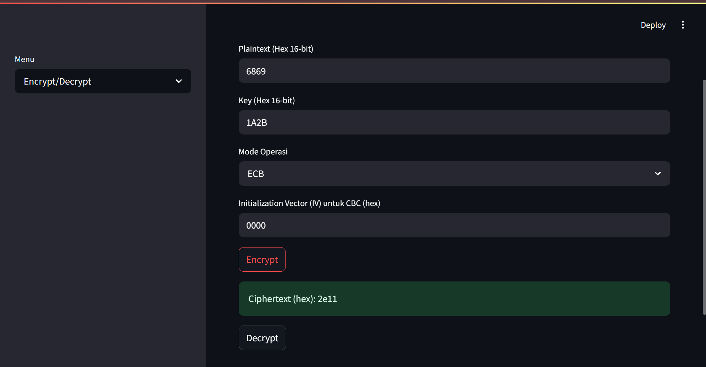
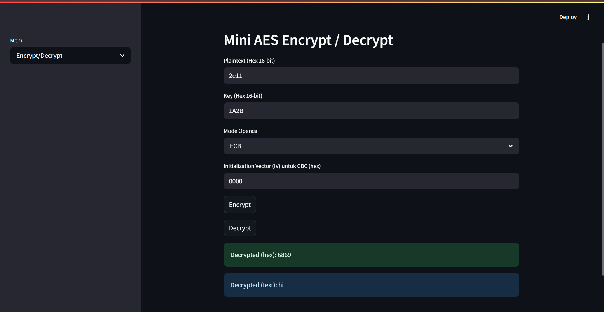
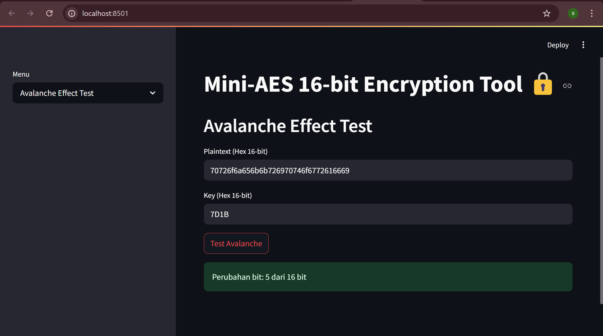

# Project Tengah Semester Mata Kuliah Kriptografi

Anggota :

- Revalina Fairuzy Azhari Putri / 5027231001
- Chelsea Vania Hariyono / 5027231003
- Salsabila Rahmah / 5027231005
- Riskiyatul Nur Oktarani / 5027231013
- Farida Qurrotu A'yuna / 5027231015

# Mini-AES 16-bit Encryption

Mini-AES 16-bit Encryption adalah implementasi algoritma AES versi mini yang menggunakan kunci dan blok data 16-bit. Program ini menyediakan enkripsi dan dekripsi dalam dua mode operasi: ECB (Electronic Codebook) dan CBC (Cipher Block Chaining). Program ini juga mencakup uji avalanche effect dan operasi file.

## Fitur

1. Enkripsi/dekripsi Mini-AES 16-bit (ECB & CBC)

    Enkripsi dan dekripsi data menggunakan algoritma Mini-AES 16-bit yang mengolah blok dan kunci sebesar 16-bit.

    - Tersedia dalam dua mode operasi:

        - ECB (Electronic Codebook)

        - CBC (Cipher Block Chaining)

2. Operasi SubNibbles, ShiftRows, MixColumns, dan AddRoundKey

    - SubNibbles: Penggantian 4-bit menggunakan S-Box.

    - ShiftRows: Penggeseran posisi nibble di blok.

    - MixColumns: Operasi pencampuran kolom menggunakan GF(2⁴).

    - AddRoundKey: XOR antara blok dan kunci setiap round.

3. Key Expansion untuk round keys

    Ekspansi kunci untuk menghasilkan 3 round-keys yang digunakan selama proses enkripsi dan dekripsi.

4. Avalanche Effect Test

    Menguji efek perubahan bit pada ciphertext dengan memodifikasi satu bit pada plaintext dan mengukur jumlah perubahan bit.

5. File Operations (upload, encrypt, decrypt .txt)

    - Mengunggah file .txt, mengenkripsi, dan mendekripsi data menggunakan kunci dan mode yang dipilih.

    - Menyimpan ciphertext dan hasil dekripsi ke dalam file output.

6. Input/output dalam format hexadecimal

    Program menerima input dalam format hexadecimal 16-bit dan memberikan output dalam format yang sama untuk ciphertext dan hasil dekripsi.

7. Streamlit GUI dengan tiga menu (Encrypt/Decrypt, Avalanche Effect, File Operations)

    - Antarmuka pengguna menggunakan Streamlit untuk melakukan operasi enkripsi/dekripsi dan tes avalanche secara interaktif.

    - Pengguna dapat memilih mode operasi (ECB atau CBC), mengupload file, dan melihat hasil enkripsi/dekripsi.

8. State Management untuk menyimpan hasil enkripsi/dekripsi

    Menggunakan st.session_state untuk menyimpan hasil ciphertext dan konfigurasi enkripsi, sehingga pengguna dapat melanjutkan dekripsi tanpa perlu menginput ulang data.

## Penjelasan dan Dokumentasi
Dokumentasi ECB



Dokumentasi CBC

Dokumentasi Avalanche Effect Text


### SubNibbles

Fungsi `sub_nibbles` menggantikan setiap nibble (4-bit) pada blok data menggunakan **S-Box** yang telah ditentukan. Setiap nibble pada blok diubah sesuai dengan nilai pada **S-Box** yang sudah didefinisikan.

**Tabel S-Box:**
| Input (Hex) | Output (Hex) |
|-------------|--------------|
| 0x0         | 0x9          |
| 0x1         | 0x4          |
| 0x2         | 0xA          |
| 0x3         | 0xB          |
| 0x4         | 0xD          |
| 0x5         | 0x1          |
| 0x6         | 0x8          |
| 0x7         | 0x5          |
| 0x8         | 0x6          |
| 0x9         | 0x2          |
| 0xA         | 0x0          |
| 0xB         | 0x3          |
| 0xC         | 0xC          |
| 0xD         | 0xE          |
| 0xE         | 0xF          |
| 0xF         | 0x7          |

Fungsi ini digunakan untuk mengganti nibble setiap byte dalam blok data, untuk menciptakan lebih banyak kekacauan (confusion) dalam proses enkripsi.

cuplikan kode : 

```
def sub_nibbles(block):
    return ((SBOX[(block >> 12) & 0xF] << 12) |
            (SBOX[(block >> 8) & 0xF] << 8) |
            (SBOX[(block >> 4) & 0xF] << 4) |
            (SBOX[block & 0xF]))
```

### ShiftRows

Fungsi `shift_rows` menggeser posisi nibble dalam blok data untuk meningkatkan kekacauan data. Operasi ini menggeser nilai pada baris pertama, kedua, dan seterusnya untuk membuat data lebih kompleks.

ShiftRows pada Mini-AES 16-bit hanya menukar nibble tertentu pada blok. Misalnya, pada blok 4-byte:

    - Sebelum shift :
    
    `[n0 n1]`
    `[n2 n3]`

    - Setelah shift : 

    `[n0 n1]`
    `[n3 n2]`

### MixColumns

    Fungsi mix_columns mencampur data dalam kolom-kolom blok menggunakan operasi GF(2⁴). Operasi ini berfungsi untuk lebih mengacak data dan menyebarkan bit ke seluruh blok.

    Mixing dilakukan antara nibble 1 dengan 3 dan nibble 2 dengan 4, untuk menghasilkan ciphertext yang lebih kompleks.

    Cuplikan kode : 

```
    def mix_columns(block):
    n0 = (block >> 12) & 0xF
    n1 = (block >> 8) & 0xF
    n2 = (block >> 4) & 0xF
    n3 = block & 0xF

    m0 = gf_mult(n0, 1) ^ gf_mult(n2, 4)
    m1 = gf_mult(n0, 4) ^ gf_mult(n2, 1)
    m2 = gf_mult(n1, 1) ^ gf_mult(n3, 4)
    m3 = gf_mult(n1, 4) ^ gf_mult(n3, 1)

    return (m0 << 12) | (m1 << 8) | (m2 << 4) | m3
```

    ### AddRoundKey

    Fungsi `add_round_key` melakukan operasi XOR antara blok data dan round key. Setiap blok data akan XOR dengan kunci yang berbeda setiap ronde untuk meningkatkan keamanan.

    Cuplikan kode : 

```
    def add_round_key(block, key):
    return block ^ key
```

### Key Expansion

Fungsi `key_expansion` digunakan untuk menghasilkan round keys dari kunci utama. Kunci utama 16-bit akan diperluas menjadi tiga kunci untuk digunakan di tiga ronde enkripsi.

Cuplikan kode : 

```
def key_expansion(key):
    w = [0] * 6
    w[0] = (key >> 8) & 0xFF
    w[1] = key & 0xFF
    w[2] = w[0] ^ 0b10000000 ^ ((SBOX[w[1] >> 4] << 4) | SBOX[w[1] & 0x0F])
    w[3] = w[2] ^ w[1]
    w[4] = w[2] ^ 0b00110000 ^ ((SBOX[w[3] >> 4] << 4) | SBOX[w[3] & 0x0F])
    w[5] = w[4] ^ w[3]

    round_keys = [
        (w[0] << 8) | w[1],
        (w[2] << 8) | w[3],
        (w[4] << 8) | w[5],
    ]
    return round_keys
```

### Avalanche Effect Text
Avalanche effect adalah efek perubahan besar pada hasil enkripsi hanya karena perubahan kecil pada input (plaintext atau key).

Cuplikan kode :
```
def avalanche_effect(plaintext, key):
    cipher1 = mini_aes_encrypt(plaintext, key)
    cipher2 = mini_aes_encrypt(plaintext ^ (1 << 0), key)  # flip 1 bit di plaintext
    diff = cipher1 ^ cipher2
    return bin(diff).count('1')  # hitung berapa bit berubah
```